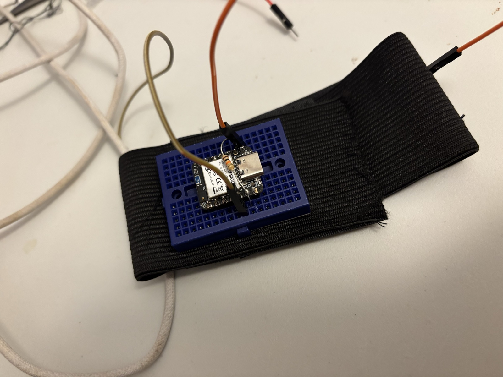

# FORM Lab

Bench app for the FORM stretch sensor. Reads a XIAO nRF52840 Sense over USB or Bluetooth, shows live cord resistance and motion, records labelled sessions to CSV, and charts every recording with rep detection.



**v1 prototype, Sept 5, 2026.** The whole breadboard rides on the elastic band, the cord runs along the band under it, and the board is powered and read over USB. First on-body recording: 5 curls, 5 clear peaks.

The `sessions/` folder is the shared dataset. Everyone who records commits and pushes their sessions so the data lives in one place.

## Set up on a new laptop (Suna, read this)

1. Install Node.js if you don't have it: https://nodejs.org (the LTS version). Check with `node -v` in Terminal.
2. Get the code:
   ```
   git clone https://github.com/gigialc/form-lab.git
   cd form-lab
   npm install
   ```
3. Start it:
   ```
   npm start
   ```
4. Open http://localhost:4000 in your browser. Leave the Terminal window open while you use it.

## Set up the board (once per XIAO)

The XIAO needs the FORM program on it. No Arduino IDE needed.

1. Plug the XIAO into the laptop with a USB-C cable that carries data (some charging cables don't).
2. Find the tiny RST button next to the USB port. Tap it twice quickly. A drive called **XIAO-SENSE** appears on the desktop.
3. Drag `firmware/form_logger_ble.uf2` from this folder onto that drive.
4. The drive disappears by itself and the Mac may complain "Disk Not Ejected Properly". That's normal. The board is now running the program.
5. In FORM Lab the dot in the top right turns green.

If the board's LED is blinking red, it's in rescue mode and the program isn't running: tap RST **once**.

## Use Bluetooth without a USB data connection

1. Power the XIAO from its battery and start FORM Lab with `npm start` on the laptop.
2. Open http://localhost:4000 in Chrome or Edge.
3. Click **Connect Bluetooth** in the top-right corner.
4. Select **FORM Band** in the browser's device picker.
5. Wait for the status to read **FORM Band · Bluetooth**. Live resistance and motion now arrive directly in the browser; Record, Mark, session history, and CSV download continue to use the local FORM Lab server.

The browser asks you to choose the device because Web Bluetooth access must begin with a user action. Bluetooth requires a supported browser on `localhost` or HTTPS. If the button says **Bluetooth unavailable**, use a current Chrome or Edge window rather than Safari or Firefox.

## Wiring

```
XIAO 3V3 ──[ rubber cord, alligator clip each end ]──┬── XIAO A0
                                                     │
                                                  [ 1 kΩ ]
                                                     │
                                                XIAO GND
```
Cord on the 3V3 side, resistor on the GND side. Use 3V3, never 5V.
The firmware is calibrated for the installed 1 kΩ fixed resistor.

## Recording

Follow the recording protocol (the FORM Recording Protocol page). Short version: band on the right bicep, board on the upper arm with USB toward the shoulder, fill the form, Record, 3 s still, do the set counting out loud, 3 s still, Stop & save. For messy gym sessions, type a word in the mark box and press Enter whenever something changes.

## Sharing what you recorded

After a session, in Terminal inside the `form-lab` folder:
```
git pull
git add sessions
git commit -m "sessions: <your name> <date>"
git push
```
`git pull` first so you get everyone else's recordings too.

## Docs
- `docs/bench-manual.html` — the picture-by-picture bench manual: pieces, soldering, wiring, the first readings, the on-arm test, and the wireless plan. Open it in a browser.
- `docs/recording-protocol.html` — what to record and how to label it: setup rule, label fields, the eight exercise classes, clean sets, the messy gym session script.

## What's in here
- `server.js` — Node server. Accepts USB serial or browser-relayed BLE sample batches, sends server-sent events at `/stream`, and exposes REST under `/api`.
- `public/index.html` — the page. Direct Web Bluetooth receiver and canvas charts, no framework.
- `sessions/` — one `.csv` per recording (`t_ms,raw,volts,ohms,ax,ay,az,gx,gy,gz` at 20 Hz) and a `.json` beside it with the labels and marks.
- `firmware/form_logger.uf2` — the board program, drag-and-drop installable. Source in `firmware/form_logger/form_logger.ino` (build with the Arduino board "XIAO nRF52840 Sense (No Updates)" and the "Seeed Arduino LSM6DS3" library).

## Rep detection
Baseline = 10th percentile of the trailing 8 s (follows the rubber's slow relaxation). A rep = an excursion above baseline + max(60 Ω, 8 %), peaks at least 0.8 s apart. Time under tension = seconds spent above that threshold.
